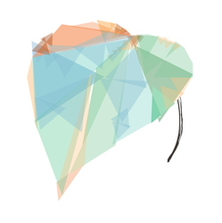
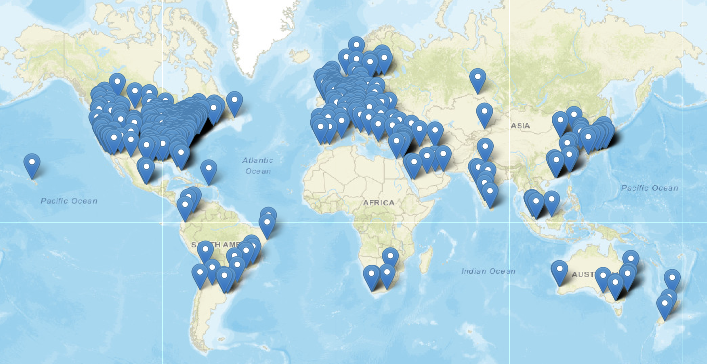

# Preliminaries

```{r}
#| label: setup
#| include: false
library(kableExtra)
library(ggplot2)
library(leaflet)
library(dplyr)
library(forcats)
library(readr)
library(stringr)
library(tidyr)

source("R/play_barplot.R")
```

---

```{r}
#| label: fig-cog-bbag-talk-qr
#| fig-cap: "<https://gilmore-lab.github.io/2026-10-14-quant-dev/>"
plot(qrcode::qr_code("https://gilmore-lab.github.io/2026-10-14-quant-dev/"))
```

## Acknowledgements

- NIH: [5U01HD076595-03 ](https://reporter.nih.gov/search/P_AwvNMwlUmSVetRzaj69w/project-details/8828267); [1R01HD094830-01](https://reporter.nih.gov/search/P_AwvNMwlUmSVetRzaj69w/project-details/9500957)
- NSF: [1238599](https://www.nsf.gov/awardsearch/show-award/?AWD_ID=1238599&HistoricalAwards=false); [2032713](https://www.nsf.gov/awardsearch/show-award/?AWD_ID=2032713&HistoricalAwards=false); [2444730](https://www.nsf.gov/awardsearch/show-award/?AWD_ID=2444730&HistoricalAwards=false)
- New York University, Penn State
- The Alfred P. Sloan Foundation, SRCD, Lego Foundation, James S. McDonnell Foundation, DARPA, The Association of Religion Data Archives (The ARDA), The Johns S. Templeton Foundation 

## Agenda

- A personal journey in open developmental science
- The future of open developmental science

# A personal journey in open developmental science

## What kind are you?

::: {.fragment}
:::: {.columns}
::: {.column width=50%}
### Data Consumer

{width="70%" fig-align="center"}
:::
::: {.column width=50%}
### Data Producer

{fig-align="center"}
:::
::::
:::

## A tale of two eras

::: {.fragment}
:::: {.columns}
::: {.column width=50%}
### BC^[Before the conversation.]
:::
::: {.column width=50%}
### AD^[After Databrary.]
:::
::::
:::

::: {.fragment}
:::: {.columns}
::: {.column width=50%}
{fig-align="center" width="50%"}

:::
::: {.column width=50%}
{fig-align="center"}
:::
::::
:::
 
## Before

:::: {.columns}

::: {.column width=50%}
::: {.fragment}

- Lab-based developmental vision science
  - How working memory develops in infancy
  - How complex motion perception develops
  - Various side projects

:::

:::

::: {.column width=50%}
::: {.fragment}

- Small samples, computer-based tasks, behavioral & neural data
- Semi-manual data processing and visualization
- No sharing of data, code, methods
- No replication, focus on reproducibility 

:::
:::
::::

## Afterward

:::: {.columns}
::: {.column width=50%}
- (Shared) data, code, materials >> my specific findings
- Behavioral scientists can (and should) study meaningful behavior
- Current practices slow progress in discovery
:::
::: {.column width=50%}
- Showing your work is easy with the right tools^[I favor [Quarto](https://quarto.org).]
- Workable policies & technologies for safely & securing sharing sensitive and identifiable data are essential^[And always under scrutiny.]
- Policy development for [SRCD](https://www.srcd.org/policy-scientific-integrity-transparency-and-openness), [PSU Open Scholarship Initiative](https://penn-state-open-science.github.io/)
:::
::::

# Databrary

## Can identifiable data

:::: {.columns}
::: {.column width=50%}
- Especially video & audio^[Plus birth dates, test dates, address/geo information.]
- Be shared *unaltered*?
:::
::: {.column width=50%}

:::
::::

# 

](https://databrary.org/assets/logo-nav-dQIvaOqh.svg)

## What is it?

- Data library
- Housed at NYU
- Specialized for storing, sharing *identifiable data*
- Sponsored by NIH & NSF
- Online since March 2014

## How!?

- Restricted access
- Explicit [sharing release](https://databrary.org/support/irb) from participants/parents/staff
- Institutional [agreements](https://databrary.org/about/agreement) 

## 

.](include/img/databrary-release-levels.png){#fig-databrary-release-levels width="85%"}

## Restricted access

:::: {.columns}
::: {.column width=50%}
- *Private*: Accessible only to data owner + people supervised by owner
- *Authorized Users*: Accessible to Authorized Users (for broad research reuse)
:::
::: {.column width=50%}

:::
::::

::: {.fragment}
```{r}
#| message: false
#| include: false
library(databraryr)

login_db(email = Sys.getenv("DATABRARY_LOGIN"),
         password = Sys.getenv("DATABRARY_PASSWORD"),
         client_id = Sys.getenv("DATABRARY_CLIENT_ID"),
         client_secret = Sys.getenv("DATABRARY_CLIENT_SECRET"),
         store = FALSE,
         overwrite = FALSE)
```

```{r}
#| echo: true
#| code-fold: false
databraryr::get_release_levels()
```
:::


## Restricted access

:::: {.columns}
::: {.column width=50%}
- *Learning Audiences*: Accessible to Authorized Users (for broad research reuse) + permission to show clips in public talks
- *Public*: Accessible to anyone (e.g., non-identifiable displays)
:::
::: {.column width=50%}

:::
::::

## Explicit sharing permission

:::: {.columns}
::: {.column width=50%}
- Adult & minor parent/guardian [permission](https://databrary.org/support/irb/release-template)
- Child assent
- [Research staff](https://databrary.org/support/irb/staff-agreement)
- Release [script](https://databrary.org/support/irb/script)
:::
::: {.column width=50%}
::: {.fragment}

:::
:::
::::

---

{#fig-databrary-map}

## By the numbers

```{r}
#| echo: true
db_stats <- databraryr::get_db_stats()
```

:::: {.columns}
::: {.column width=50%}
- *N*=`{r} db_stats$institutions` institutions
- *N*=`{r} format(db_stats$investigators, big.mark = ",")` institutionally-authorized investigators
- *N*=`{r} db_stats$affiliates` staff & trainees
- *N*=`{r} format(db_stats$hours_of_recordings, big.mark = ",")` hours of shared recordings
:::
::: {.column width=50%}

:::
::::

## Databrary @ Penn State {.scrollable}

:::: {.columns}
::: {.column width=50%}
```{r}
psu_info <- get_institution_by_id(institution_id = 12)
if (psu_info$has_avatar) {
  avatar_fn <- get_institution_avatar(12, dest_path = "tmp/psu_avatar.png")
}
```

{#fig-map fig-align="left"}
:::
::: {.column width=50%}
```{r}
#| label: fig-map-lat-lon
#| fig-cap: "A map generated via lat/lon data provided via the Databrary API."

lat <- as.numeric(psu_info$latitude)
lon <- as.numeric(psu_info$longitude)

leaflet() %>%
  addTiles() %>%  # Adds the default OpenStreetMap map background
  addMarkers(lng = lon, lat = lat, popup = "We are...")
```
:::
::::

## Researchers @ Penn State {.scrollable}

```{r}
#| echo: true
psu_ais <- list_institution_affiliates(institution_id = 12)
```

- There are *n*=`{r} dim(psu_ais)[1]` *Authorized Investigators*

```{r}
#| echo: true
#| label: tbl-psu-databrary-ais
#| tbl-cap: "Authorized Investigators @ Penn State UP"
psu_ais |>
  dplyr::select(user_id, user_prename, user_sortname) |>
  dplyr::rename(id = user_id, first = user_prename, last = user_sortname) |>
  kableExtra::kable() |>
  kable_styling("striped", full_width = FALSE) |>
  scroll_box(width = "900px", height = "250px")
```

## Data @ Penn State

```{r}
#| echo: true
source("R/get_institution_user_stats.R")
psu_stats <- get_institution_statistics(12)
psu_user_stats <- get_institution_user_stats(12)
user_uploaded_data_footprint <- sum(psu_user_stats$uploaded_data_footprint)
user_uploaded_n_files <- sum(psu_user_stats$files_number)
user_volumes_number <- sum(psu_user_stats$volumes_number)
```

- Researcher "owned"^[Under PSU policy, researchers do not own their data. See [RP15](https://policy.psu.edu/policies/rp15).]
  - `{r} format(user_uploaded_data_footprint/1e9, digits = 4, big.mark = ",")` GB of data, *n*=`{r} format(user_uploaded_n_files, digits = 5, big.mark = ",")` files in *n*=`{r} format(user_volumes_number, digits = 3, big.mark = ",")` volumes/datasets
- Institutionally "owned"^[Investigator(s) no longer affiliated with Penn State.]
  - `{r} format(psu_stats$uploaded_data_footprint/1e9, digits = 4, big.mark = ",")` GB, *n*=`{r} format(psu_stats$files_number, digits = 5, big.mark = ",")` files in *n*=`{r} format(psu_stats$volumes_number, digits = 3, big.mark = ",")` volume/dataset
  
## New features

- Secure API for scriptable interactions (up/download)^[NSF 2444730]
  - [*databraryr*](https://github.com/NYU-Databrary/databraryr) (R)
  - *databrarypy* (Python)
- Custom collections^[NSF 2444730]
  - Curate your own set of clips, datasets
- External integrations
  - Add geographically-informed data from U.S. Census^[In collaboration with [The ARDA](https://thearda.org); financial support from the John S. Templeton Foundation.]
  
## Aspirations

- Membership model
- Platform for discovery
  - Active curation [@Soska2021-mh]
  - Metadata standardization & documentation
  - Scripted (reproducible) access
  - Improved search & filtering
- Private/restricted access AI model-building

---

# Play & Learning Across a Year (PLAY)

---



---

:::: {.columns}
::: {.column width=50%}

:::
::: {.column width=50%}

:::
::::

## Dataset

{#fig-embargoed-data-release}

## PLAY Summary

```{r}
#| label: play-csv-data
play_raw_df <- readr::read_csv("private/csv/Play_&_Learning_Across_a_Year_(PLAY)_project_-_data_release.csv")
#| echo: true
play_df <- play_raw_df |>
  mutate(particip_id = stringr::str_extract(file_name, "[A-Z]{5}_[0-9]{3}")) |>
  distinct() |>
  filter(!is.na(particip_id)) |>
  rename(
    ethnicity = `participant-1-ethnicity`,
    language = `participant-1-language`,
    gender = `participant-1-gender`,
    race = `participant-1-race`,
    age_wks = `participant-1-age_weeks`,
    age_mos = `participant-1-age_months`,
    gold_silver = `group-1-name`,
    sharing = container_release_level
  ) |>
  mutate(
    english = str_detect(language, "English"),
    spanish = str_detect(language, "Spanish"),
    english_spanish = str_detect(language, "English, Spanish"),
  ) |>
  mutate(gold_silver = if_else(str_detect(gold_silver, "No_"), "No_visit", gold_silver)) |>
  filter(gold_silver %in% c("PLAY_Gold", "PLAY_Silver")) |>
  select(
    particip_id,
    ethnicity,
    gender,
    race,
    age_wks,
    age_mos,
    gold_silver,
    sharing,
    english,
    spanish,
    english_spanish
  ) |>
  distinct()
```

```{r}
#| label: play-data-n-files
#| echo: true
play_summ_n_files_df <- play_df |>
  group_by(particip_id) |>
  summarise(n_files = n())
```

- *N*=`{r} dim(play_summ_n_files_df)[1]` participant dyads
- *N*=`{r} format(sum(play_summ_n_files_df$n_files), big.mark = ",", digits = 4)` shared files

## PLAY sharing permission

```{r}
#| label: fig-play-data-release
#| fig-cap: "Sharing permissions granted for PLAY corpus. Note that most parents gave permission to share data and allow excerpts to be shown."

play_sharing <- play_df |>
  group_by(sharing) |>
  summarise(n_dyads = n())  

play_sharing |>
  mutate(sharing = fct_reorder(sharing, n_dyads)) |>
  ggplot() +
  geom_col(aes(x = sharing, y = n_dyads, fill = sharing)) +
  geom_text(aes(x = sharing, y = n_dyads + 40, 
                label = n_dyads),
            vjust = 0) +
  coord_flip() +
  theme_classic() +
  theme(legend.position = "none") +
  xlab("") +
  ylab("dyads") +
  theme(axis.text = element_text(size = 18),
        axis.title = element_text(size = 18))
```

## PLAY age @ observation

```{r}
#| label: fig-play-age-mos
#| fig-cap: "Age (in months) at observation. We targeted 12, 18, and 24 mos (+/- 1 mo)."
play_df |>
  filter(!is.na(age_wks)) |>
  filter(sharing %in% c("learning_audiences", "authorized_users")) |>
  mutate(age_mos = as.numeric(age_wks)/4.33) |>
  ggplot() +
  aes(x = age_mos) +
  geom_histogram(bins = 18) +
  theme_classic() +
  xlab("Age (mos)") +
  ylab("Participants") +
  theme(axis.text = element_text(size = 18),
        axis.title.x = element_text(size = 18),
        axis.title.y = element_text(size = 18))
```

## Race

```{r}
#| label: fig-play-race
#| fig-cap: "Parent-reported race of child."
play_race <- play_df |>
  group_by(race) |>
  summarise(n_dyads = n())

play_race |>
  mutate(race = fct_reorder(race, n_dyads)) |>
  ggplot() +
  geom_col(aes(x = race, y = n_dyads, fill = race)) +
  geom_text(aes(x = race, y = n_dyads + 40, 
                label = n_dyads),
            vjust = 0) +
  coord_flip() +
  theme_classic() +
  theme(legend.position = "none") +
  xlab("") +
  ylab("dyads") +
  theme(axis.text = element_text(size = 18),
        axis.title = element_text(size = 18))
```

## Ethnicity

```{r}
#| label: fig-play-demog-ethnicity
#| fig-cap: "Parent-reported ethnicity of child."

play_ethnicity <- play_df |>
  group_by(ethnicity) |>
  summarise(n_dyads = n())

play_ethnicity |>
  mutate(ethnicity = fct_reorder(ethnicity, n_dyads)) |>
  ggplot() +
  geom_col(aes(x = ethnicity, y = n_dyads, fill = ethnicity)) +
  geom_text(aes(x = ethnicity, y = n_dyads + 40, label = n_dyads), vjust = 0) +
  coord_flip() +
  xlab("") +
  ylab("dyads") +
  theme_classic() +
  theme(legend.position = "none") +
  theme(axis.text = element_text(size = 18),
        axis.title = element_text(size = 18))
```

## Languages spoken at home

```{r}
#| label: fig-play-langs-at-home
#| fig-cap: "Parent report of whether English or Spanish (or both) are spoken to the child at home."
play_lang <- play_df |>
  select(particip_id, english, spanish, english_spanish) |>
  mutate(english_only = ifelse(english & !spanish, TRUE, FALSE),
         spanish_only = ifelse(spanish & !english, TRUE, FALSE)) |>
  pivot_longer(
    cols = c(english_only, spanish_only, english_spanish),
    names_to = "language",
    values_to = "speaks"
  ) |>
  select(particip_id, language, speaks) |>
  mutate(lang_at_home = if_else(speaks == TRUE, language, NA)) |>
  filter(!is.na(lang_at_home)) |>
  select(particip_id, lang_at_home)

play_barplot(play_lang, lang_at_home)
```

## Let's take a peak

{#fig-play-release-volume-databrary}

## PLAY status

- Shared with launch group (data collectors, coders, advisers)
- Shared broadly (with Databrary Authorized Investigators) next summer
- Opportunities to mine/enhance/do research on the data now

## Automation in PLAY

- Extensive use of Databrary API, *databraryr*
- Simple demos throughout this talk
  - Download to secure, encrypted (non-version-controlled) directory
  - Clean and process data for aggregation, visualization, analysis
- Project website & full protocol in [Quarto](https://quarto.org).
  
```{r}
#| include: false
logout_db()
```

# What about AI?

## Or, the law of unintended consquences

## Disclosive reidentification {.scrollable}

{#fig-disclosive-reid width = "65%"}

## Public sharing of pseudo-anonymized data

- A standard practice

::: {.incremental}
- If well-curated (big if), may accelerate discovery
- Provides no protection against disclosive reidentification
- Provides weak encouragement for giving scholarly credit via citation

:::

## {.center}

### Should *all* data about human participants be shared with access restrictions? 

# The future of open developmental science

## {background-color="black"}

## Imagine...

:::: {.columns}
::: {.column width=50%}
- There's no paywalls
- No "data on request" promises
- Openly shared protocols
- Data documented, too...

::: {.fragment}
>You may say I'm a dreamer, but I'm not the only one.
:::

:::
::: {.column width=50%}
![John Lennon; Wikipedia^[By Bob Gruen; Distributed by Capitol Records - Listen to This Press Kit (1974)Immediate (iHeart), Public Domain, https://commons.wikimedia.org/w/index.php?curid=175003052]](https://thumb.wikimedia.org/wikipedia/commons/thumb/8/85/John_Lennon_%22Walls_and_Bridges%22_1974_press_photo_2_%28color%29_%28cropped%29.jpg/1280px-John_Lennon_%22Walls_and_Bridges%22_1974_press_photo_2_%28color%29_%28cropped%29.jpg?utm_source=en.wikipedia.org&utm_campaign=imageinfo&utm_content=thumbnail){#fig-john-lennon-wikipedia width="75%"}
:::
::::

## Imagine...

::: {.incremental}
- Every paper comes with openly shared data
  - Data papers^[e.g., *Scientific Data*] & preregistration standard
- Linked to protocols & code^[I favor [Quarto](https://quarto.org)] that can reproduce all statistical analyses and figures
- Openly shared videos of experiments, displays^[Remember [Clever Hans](https://en.wikipedia.org/wiki/Clever_Hans)?]
- Aggregation of datasets for meta/mega/multiverse analyses made *much* easier

:::

## Imagine...

- All data shared via restricted access data repositories

## Imagine...

::: {.incremental}
- Embedding *reproducibility* & *replication* into (undergrad & grad) curriculum [@Frank2012-fc]
  - Make data visualization & [management best practices](https://penn-state-open-science.github.io/posts/2025-11-17-sleic-workshop.html) prominent
  - 1st semester projects *reproduce* a prior analysis
  - 1-2 year/master's project conducts an exact^[As possible.] *replication*^[At least for the first study of a multi-study project]

:::

## Opportunities

:::: {.columns}
::: {.column width=50%}
- Participate in Open Scholarship Initiative
  - Workshops
  - Bootcamp
  - Talks
:::
::: {.column width=50%}

:::
::::

## Opportunities

- Help Gilmore with open science projects
  - PLAY
      - Shiny app
      - New analyses of video data
      - Augment with geographically informed contextual data
  - How-to papers about *databraryr* or *databrarypy*
  - Mega-analysis of child visual acuity data

# Wrap-up

## Main points

- Openly sharing data, protocols, code is an investment in the future of discovery in psychological science
- Open sharing strengthens your research
- Restricted access sharing protects participants and their privacy
- Databrary enables open sharing of research data with access restrictions

## Main points

- PLAY project demonstrates feasibility of large-scale video-centric developmental science

# Resources

## References
